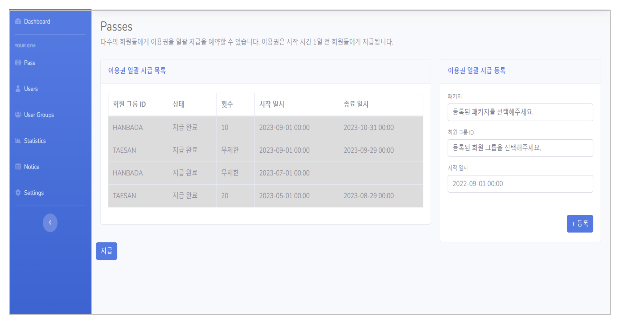
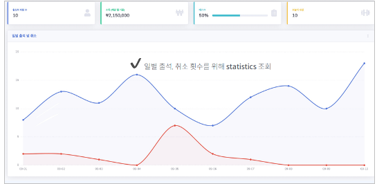
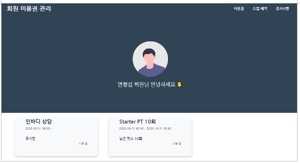
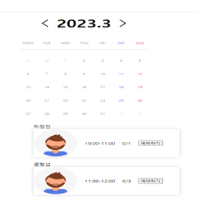

## 개인 프로젝트/ Sport 예약 메이트

### 프로젝트 소개

- 프로젝트 이름 : Sport 예약 메이트
- 프로젝트 설명 : 고객이 구매한 스포츠 수업 이용권 등록 및 지급하는 기능을 Batch 서비스를 통해 제공하는 웹 서비스
- 기술 스택 : SpringBoot, JPA, Spring Batch, Spring Security, MYSQL, Ajax, mustache
- 작업 기간 : 2023.02.08 ~ 2023.04.25 
- 사용 에디터 : IntelliJ
- 버전 관리 툴 : Git

### 개발 목적

- 스포츠 시설 서비스를 통합하여 관리하는 사이트 개발

- 수집된 데이터를 이용한 통계 그래프 제공

### 기대 효과

- 스포츠 설비 예약을 통합 관리하여 사용자에게 원활한 서비스 제공

- Spring batch를 활용한 시스템 구축으로 대용량 트래픽 발생 시의 서버 이상 방지

### 주요기능

1) PT이용권 지급 및 등록
2) 사용자 페이지 제공 및 예약기능
3) 관리자 페이지 제공 및 통계 그래프 기능

## 관리자 페이지

- 이용권 등록

- 통계자료

## 사용자 페이지

- 이용권 조회 및 로그인

- 이용권 예약

## 작동 과정

### 1) 이용권 등록 

- 관리자가 등록하고 싶은 패키지와 회원의 ID, 이용권 시작 일자를 입력한 후 이용권을 등록한다. 추후 이용권의 비용을 지급받았을 경우 발급을 통해 이용권을 활성화 한다.

### 2) 이용권 예약

- 구매한 이용권의 종류와 남은 횟수가 UI로 표시된다. 해당 이용권 UI를 클릭하면 이용권 예약 페이지로 이동하게 된다. 원하는 일자에 원하는 강사를 선택하여 체육관 이용을 예약을 진행한다.

## 성능 분석

- Spring Batch를 이용한 병렬 처리 시스템의 성능을 테스트하기 위해 1만회가량의 데이터베이스 갱신요청을 하였을 때 정상적으로 처리되는 것을 확인하였다.
  사용자가 이용권을 통해 예약을 하게 될 경우, 이용권 횟수 차감 및 강사 시간표 변경, 사용자 스포츠 등록 등의 여러 동작 과정이 병렬적으로 수행되어 기존보다 더 빠른 처리를 할 수 있게 되었고, 각 동작마다 예외처리 기능이 존재하여 오류 없이 수행된 것을 확인하였다.
  사용자가 예약한 수업끼리 겹칠 수 있는 경우에 대비하여 겹치는 시간 내에서 진행되는 수업 간의 예약은 불가능하게 하였다.
  Batch의 모니터링 시스템을 통해 사용자의 이용 현황 내역을 분석하여 통계 그래프와 DB의 정보가 동일시 되도록 하여 사용자의 출석과 취소 현황을 관리자가 실시간으로 볼 수 있도록 하였다.
